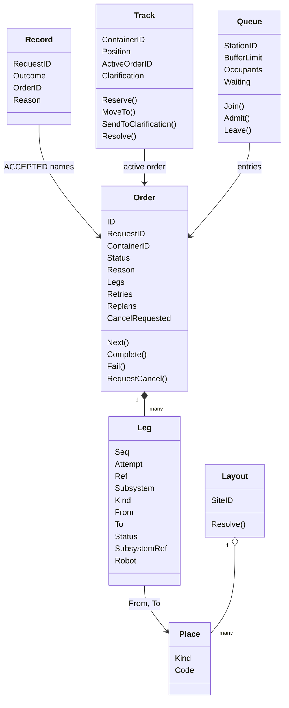

# Class diagram

```mermaid
classDiagram
  class Record {
    RequestID
    Outcome
    OrderID
    Reason
  }
  class Order {
    ID
    RequestID
    ContainerID
    Status
    Reason
    Legs
    Retries
    Replans
    CancelRequested
    Next()
    Complete()
    Fail()
    RequestCancel()
  }
  class Leg {
    Seq
    Attempt
    Ref
    Subsystem
    Kind
    From
    To
    Status
    SubsystemRef
    Robot
  }
  class Track {
    ContainerID
    Position
    ActiveOrderID
    Clarification
    Reserve()
    MoveTo()
    SendToClarification()
    Resolve()
  }
  class Queue {
    StationID
    BufferLimit
    Occupants
    Waiting
    Join()
    Admit()
    Leave()
  }
  class Layout {
    SiteID
    Resolve()
  }
  class Place {
    Kind
    Code
  }
  Record --> Order : ACCEPTED names
  Order "1" *-- "many" Leg
  Leg --> Place : From, To
  Track --> Order : active order
  Queue --> Order : entries
  Layout "1" o-- "many" Place
```

`routing.Plan` turns two places into `LegPlan`s; `capacity.Snapshot` is one subsystem's or station's capacity.
